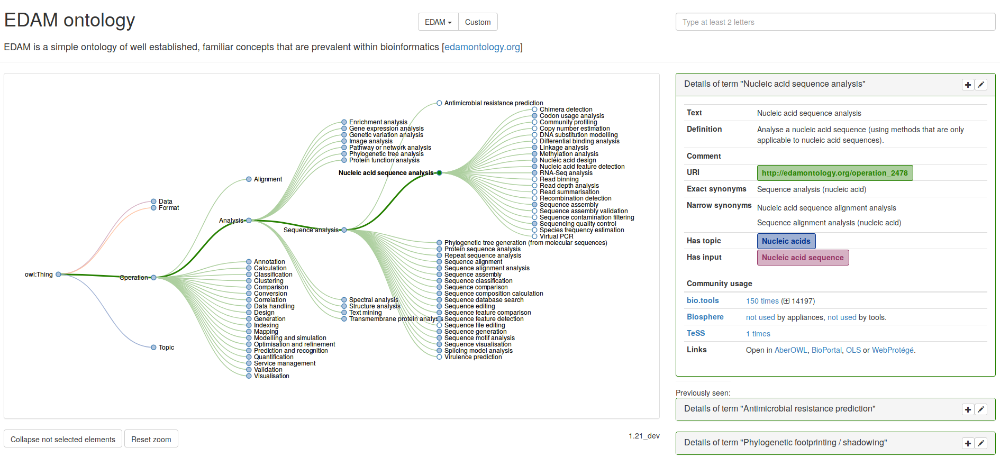
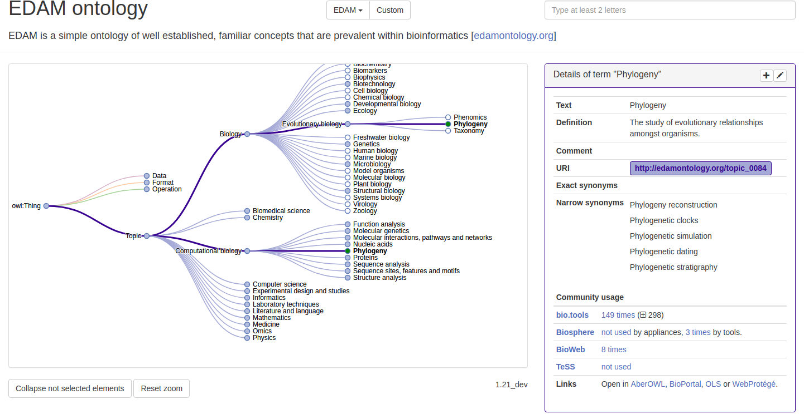
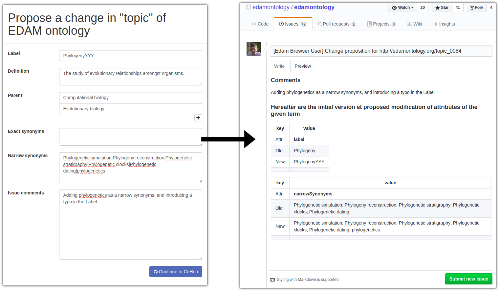

# Summary

The EDAM Browser is a client-side web-based visualization javascript widget for the navigation of the EDAM ontology [@ison2013edam]. EDAM is a structured and controlled vocabulary describing bioinformatics and computational biology concepts. It is used to annotate resource descriptions (tools, web services) for discovery [@ison2015tools] and integration in platforms such as galaxy [@afgan2016galaxy]. The EDAM Browser provides users an simple and performant interface to explore EDAM when annotating or searching for bioinformatics resources.

## User interface and functionalities

The user interface (see Fig. 1) is divided in two main panels, a tree representation of the ontology on the left, and a properties card on the right. The tree on the left represents the different parts of the ontology (formats, data, operations and topics). By expanding or closing the nodes, users explore the hierarchy of the EDAM concepts. The selected concept is displayed in bold, and the hierarchically path leading from the root to it is highlighted. In case this concept has multiple direct or indirect superclasses, all the paths that lead to its different locations in the trees are highlighted (see Fig.2). The properties card panel on the right displays the main properties of the concept, such as its definition, comments, synonyms, and its non-hierachical relations to other concepts (e.g. an operation has inputs, outputs, and belongs to a given topic). It also includes the count and links to entries in various databases that use this term,  such as [bio.tools](https://bio.tools), [BioSphere](https://biosphere.france-bioinformatique.fr/catalogue/) [@brancotte2017biosphere], [BioWeb](http://bioweb.pasteur.fr) and [TeSS](https://tess.elixir-europe.org). 
 

The user may directly suggest either the modification or creation of terms by clicking on the "add a child" and "edit" icons at the top-right corner of this panel. These lead the user to a form that directly formats suggestions as github issues ready to be submitted by the user (see Fig. 3).

Additional components of the interface include a full-text search box that let users search for concepts on their names, synonyms or descriptions; a navigation toolbar that lets users toggle the display of specific parts of the ontology only, or load locally modified versions of the ontology; and a history stack of the concepts that have been seen previously to the one currently selected, below the properties card panel.

## Architecture, installation and integration

One of the specificities of EDAM is its relatively small size in comparison with large ontologies like Gene Ontology [@ashburner2000go, @go2016go]. This reduced size makes it easy to load it entirely in the browser's memory, and enables a fast navigation that does not rely on server calls (except for displaying usage statistics from external annotated resources). The architecture of EDAM Browser is therefore very simple: it uses the D3.js library [@bostock2011d3] for visualisation and loads EDAM from a JSON-based format, lighter and easier to parse than the native OWL/XML format. This makes the system easy to download and run, either as a local HTML file or on a web server. It is also possible to integrate it in external websites and applications: the autocomplete input field and the tree visualization are re-usable, and demonstration code is [available online](https://ifb-elixirfr.github.io/edam-browser/demo.html), showing how the tree can be integrated, how the user can interact with the tree, and how to programmaticaly interact with the tree in JavaScript.

## Conclusion

The EDAM Browser is available publicly and anonymously at https://ifb-elixirfr.github.io/edam-browser/. It aims at simplicity and relevance to EDAM. The interface displays all of the information necessary to users, and avoids ontology development jargon. The EDAM Browser is not a generic ontology navigation and/or edition platform, like other systems such as AberOWL [@hoehndorf2015aber], BioPortal [@whetzel2011bioportal], OLS - Ontology Lookup Service [@jupp2015new], Ontobee [@xiang2011ontobee] and WebProt&eacute;g&eacute; [@tudorache2013webprotege]. Rather, it is tailored to the structure and properties of EDAM, and targets both contributors and users who might not be ontology experts. With this interface, users can both explore quickly and efficiently EDAM, and contribute their own expertise to the ontology. 

# References
