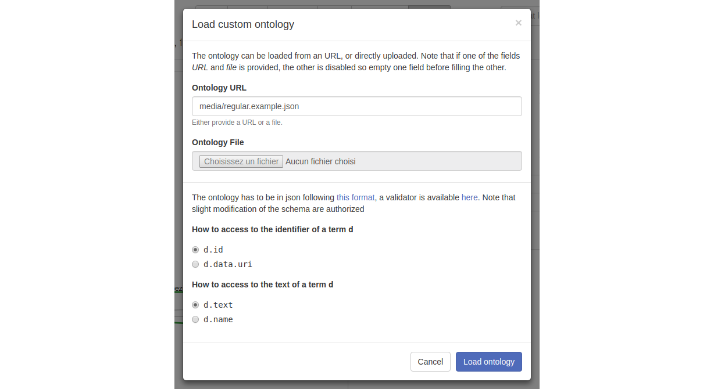

# Summary

The EDAM Browser, a client-side web-based visualization javascript widget that provides an interface to navigate the EDAM ontology [@ison2013edam]. EDAM is a structured and controlled vocabulary describing bioinformatics and computational biology concepts. It is widely used to annotate resource descriptions (tools, web services) for discovery [@ison2015tools], workflow construction and integration. The EDAM Browser is not designed to be a generic ontology navigation and/or edition platform, a goal already achieved by many other systems such as AberOWL [@hoehndorf2015aber], BioPortal [@whetzel2011bioportal], OLS - Ontology Lookup Service [@jupp2015new], Ontobee [@xiang2011ontobee] and WebProt&eacute;g&eacute; [@tudorache2013webprotege].

Rather, the EDAM Browser is tailored to the structure and properties of EDAM, and targerts both contributors and users who might not be ontology experts. It intend to help describing resources, and to facilitate and foster community contributions to EDAM.

## Availability and re-usablility

The EDAM browser is available publicly and anonymously at https://ifb-elixirfr.github.io/edam-browser/. In addition to this, its lightweight architecture makes it easy to download and run on any server or personal computer, either as a local HTML file or on a web server. It is possible to integrate the EDAM Browser and its tree representation in external websites and applications, providing a simple way for third party websites to promote EDAM-labeled resources. Both the autocomplete input field and the tree visualization are re-usable: a demonstration code is available [here](https://ifb-elixirfr.github.io/edam-browser/demo.html), showing how the tree can be integrated, how the user can interact with the tree, and how to programmaticaly interact with the tree in JavaScript.

## Information display

As much as possible, the user interface aims at simplicity and relevance to the specific domain of EDAM. The creation of an interface that displays all of the information necessary to users, and avoids the use of ontology development jargon is a major goal of this project. 

We also take into account the specificities of the structure of EDAM: while being represented as a tree, it is in fact a directed acyclic graph, meaning that a term can have more than one parent. In order to improve readability when a term is selected (1) all the term's positions are shown; and (2) all paths from the root node are highlighted. A good example of this display is the [Phylogeny topic](https://ifb-elixirfr.github.io/edam-browser/#topic_0084)) (cf Fig. 1). 

The interface also permits the navigation between different axes of the ontology, based on the EDAM properties that define their relationships (e.g. this *format* represents this type of *data*, this *data* is an output of this *operation* or is specific of this *topic*). One last salient feature of the interface is the representation of the usage of the selected concept in annotated resource collections, such as bio.tools, BioSphere [@brancotte2017biosphere], [BioWeb](http://bioweb.pasteur.fr) and [TeSS](https://tess.elixir-europe.org).

## Performance and flexibility

One of the specificities of EDAM is its relatively small size in comparison with large ontologies like Gene Ontology. This reduced size makes it easy to load entirely the contents to be displayed in the browser's memory, and enables a very fast navigation, with no need to rely on server calls during this navigation (except for displaying usage statistics from external annotated resources). 
Using the EDAM Browser to explore a local or in-development version is possible. The loaded file should be formatted as a JSON file following the schema accessible [here](https://ifb-elixirfr.github.io/edam-browser/ontology.schema.json). The [edam2json utility](https://github.com/edamontology/edam2json) can be used to generate the ontology in this format from any EDAM owl file.  

An ontology is loaded into the EDAM Browser by clicking on the button labelled _Custom_ at the top of its interface, and specifying either a public URL to the file or a local path to load it from (cf Fig. 2). 

## Facilitating community feedback.

EDAM users can contribute their own expertise to the ontology. In order to make these contributions easier, we have implemented a form that facilitates this communication. These suggestions are automatically formatted as github issues ready to be submitted by the user (cf Fig. 3). 

# References
