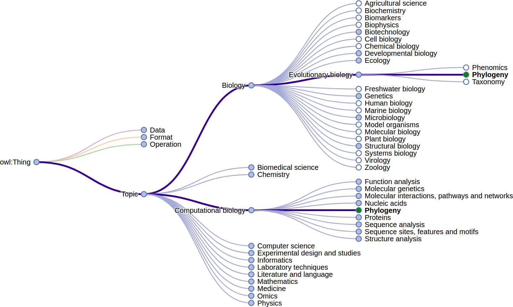
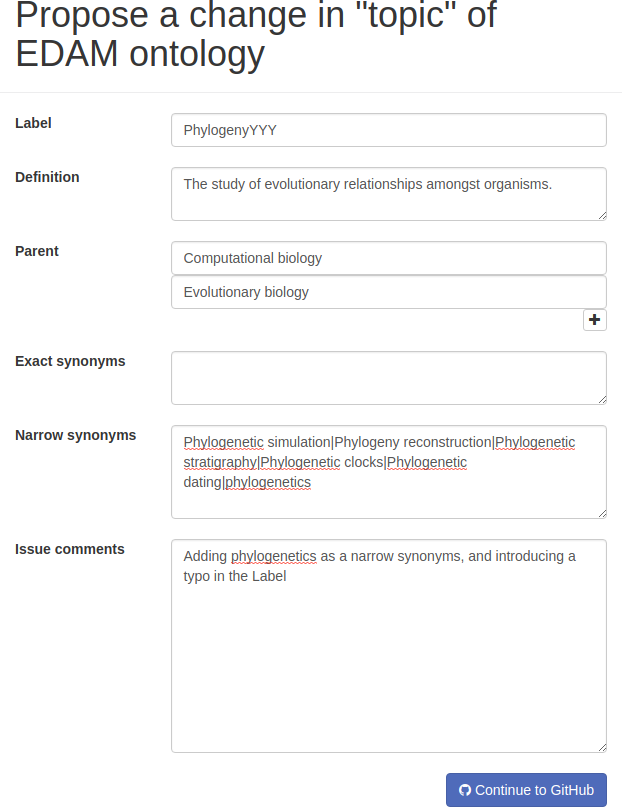

# Summary

## Abstract

Labelling, indexing and describing a resource, whether it is a software, a database, or a service is of a great help when it comes to promoting it to various user communities. As an example, in Bioinformatics, the ELIXIR bio.tools [@ison2015tools] registry contains more than ten thousands software and service entries. In this context, the use of controlled vocabularies to describe the resources is of a paramount importance. This need is addressed by the EDAM Ontology [@ison2013edam] which proposes a controlled vocabulary hierarchically organized around four concepts which are types of data, formats, operations and topics.

We here present the EDAM Browser, a client-side web-based visualization javascript widget to help describing resources, and to facilitate and foster community contributions to EDAM. More precisely, (i) we review related work and features that need to be addressed; (ii) we describe how these features are addressed by the EDAM Browser; finally (iii) we discuss its reusability.

## Related work

When considering web based browsers for ontologies, there are two main platforms (i)BioPortal [@whetzel2011bioportal], and (ii) OLS - Ontology Lookup Service [@jupp2015new]. Here after we describe criteria and there presence absence in the platforms

| id | Feature        | in BioPortal           | in OLS  |
| :-------:|----------- |:-------------:| :-----:|
| 1 |EDAM is present         | ✔       |✔   |
| 2 |Publicly available      | ✔       |  ✔|
| 3 |Handle multiple parents | ✘       |    ✔ |
| 4 |Can be integrated in any website | ✔       |    ✔ |
| 5 |Help community contributing to the ontology | ✘       |    ✘ |
| 6 |Use edited version of EDAM | ✘       |    ✘ |
| 7 |Local installation | ✘       |    ✔ (with admin rights) |

##### Criteria 1 and 2

Both platforms integrate EDAM and let not authenticated user browse it.

##### Criteria 3 "Handle multiple parents"

The Edam ontology, while being represented as a tree is a directed acyclic graph, meaning that a term can have more than one parent. When searching for "Phylogeny" Topic, [BioPortal](http://bioportal.bioontology.org/ontologies/EDAM/?p=classes&conceptid=http%3A%2F%2Fedamontology.org%2Ftopic_0084) displays it at only one position while [OLS](https://www.ebi.ac.uk/ols/ontologies/edam/terms?iri=http%3A%2F%2Fedamontology.org%2Ftopic_0084) indicates that indeed the term has multiple parents. 

##### Criteria 4 "Can be integrated in any website"

Bioportal allows to integrate [widgets](http://bioportal.bioontology.org/ontologies/EDAM/?p=widgets) such as autocomplete form, graph visualization, and tree visualization. Widget for OLS can be found in [biojs](http://biojs.io) registry.

##### Criteria 5 "Help community contributing to the ontology"

No form, nor link to the GitHub repository have been found in BioPortal and OLS to help community to contribute to the ontology by providing correction, modification, or new terms .

##### Criteria 6 "Use edited version of EDAM "

Edam ontology release a new version every trimester, the "in-developement" version can't be browser with BioPortal. With OLS authors need to do a volunteer and public submission, the new version is then accessible within hours.

##### Criteria 7 "Local installation"

Installing locally OLS is [possible](https://www.ebi.ac.uk/ols/docs/installation-guide). Software requirements includes Maven, Neo4J, MongoDB, tomcat, Solr. The installation is thus only for user with administrator rights on their computer, and computers with a certain amount of resources. No local installation of BioPortal is possible to our knowledge.


## Main functionality

Is this section we details how each features listed in previous section are addressed.


##### Criteria 1 and 2

The EDAM Browser is publicly (criteria 1) and does not require authentication (criteria 2). 

##### Criteria 3

The term duplication is [handled](https://ifb-elixirfr.github.io/edam-browser/#topic_0084). In order to improve readability when a term is selected (1) all it duplicates are; and (2) path from the root node is highlighted to all selected terms.



##### Criteria 4

The ability to integrate the EDAM Browser, and its tree representation is of a paramount importance to help third part website to promote their resources when labeled with edam. Both the autocomplete inout field and the tree  visualization are re-usable. To highlight this statement we build up a dynamic [demo](https://ifb-elixirfr.github.io/edam-browser/demo.html) showing how it can be integrated, how the user can  interact with the tree, and how programatically any script can interact with the tree. 

##### Criteria 5

Letting user contribute to the ontology improve acceptance by the community by letting him/her propose changes to the ontology. By contribution we mean correcting a definition, proposing new synonyms, and also proposing new terms. The EDAM Browser give access to a form letting the user propose the changes and then format his/her changes in a github issue ready to be submitted by the user. 




##### Criteria 6

Using the EDAM Browser to explore an custom ontology is possible, the ontology should be in the following [json schema](http://json-schema.org/), and be accessible trough http. The user only have to open the EDAM Browser, click on the plus sign in the top of it interface and provide the url where the ontology file can be found.


```json
{
    "$ref": "#/definitions/EDAMBrowserTerm",
    "definitions": {
        "EDAMBrowserTerm": {
            "type": "object",
            "additionalProperties": false,
            "properties": {
                "id": {
                    "type": "string"
                },
                "text": {
                    "type": "string"
                },
                "description": {
                    "type": "string"
                },
                "children": {
                    "type": "array",
                    "items": {
                        "$ref": "#/definitions/EDAMBrowserTerm"
                    }
                }
            },
            "required": [
                "id",
                "text"
            ],
            "title": "EDAMBrowserTerm"
        }
    }
}
```

##### Criteria 7

The EDAM Browser can easily be downloaded and run a the personal computer. The only requirement is python, though that git is helpful.
Once downloaded, the user can also use a custom version of the  ontology, including beta version of the next release or whole new ontology. By default, ontology should be in the [json schema](http://json-schema.org/) presented previously, but the browser can be configured to use a different schema (c.f: hereafter). A validator is available [here](https://jsonschemalint.com/).

## Reusability

The tree based visualization of the EDAM Browser uses [d3.js](https://d3js.org/) v3 [d3js]. In order to make the tree re-usable we  used [Javascript Closures](http://jibbering.com/faq/notes/closures/) following 
[Towards Updatable D3.js Charts](https://www.toptal.com/d3-js/towards-reusable-d3-js-charts)  and
[Towards Reusable Charts](https://bost.ocks.org/mike/chart/). It allows us to have encapsulated chart easily parameterizable. 

The following example comes from the demo and shows how  to visualize the ontology at `media/topic_extended.biotools.min.json` in the div `#tree` with the `Bioinformatics` term initially selected. Note that as the format of the file does not follow the recommendation, we have to override the  getter to access to the identifier.

```javascript
my_tree = interactive_tree()
    //overriding as the identifier by default consider d.id
    .identifierAccessor(function(d){return d.data.uri;})
    .debug(true)
    .tooltipEnabled(true)
    //at first Bioinformatics should be selected
    .initiallySelectedElementHandler(function(d){
        return d.data.uri==="http://edamontology.org/topic_0091"
    })
    //call the demo (next step you see) when the tree have been loaded
    .loadingDoneHandler(demo)
;
// pre-draw/build chart in div
d3.select("#tree").call(my_tree);
//indicated where the data can be found
my_tree.data_url("media/topic_extended.biotools.min.json");
```


## Conclusion

Labeling and indexing resources is of a paramount importance to improve visibility and adption by the targeted  community. We here presented the EDAM Browser which allows user to browse the ontology, and resource owner to  easily display the terms used to label the resource. We enumerated 7 major features and showed that state of the art web based ontology browser does not provide all of them while EDAM Browser does. Finally we described how it can be easily re-used in any third part website.

# References
